# Assignment 3 - Responsive Web Design (Media Queries + Bootstrap Grid)

**Name:** _your name_
**Group:** _your group_

## Part 1. Media Queries

### Task 0. Responsive Typography
Create a simple webpage with headings and paragraphs. Use media queries to change font sizes for mobile, tablet, and desktop.

Implementation: mobile styles are the default (h1 24px, h2 18px, p 14px). Media queries with `min-width: 768px` (tablet: 36 / 26 / 18px) and `min-width: 1024px` (desktop: 48 / 32 / 22px) increase the font sizes.

Desktop:
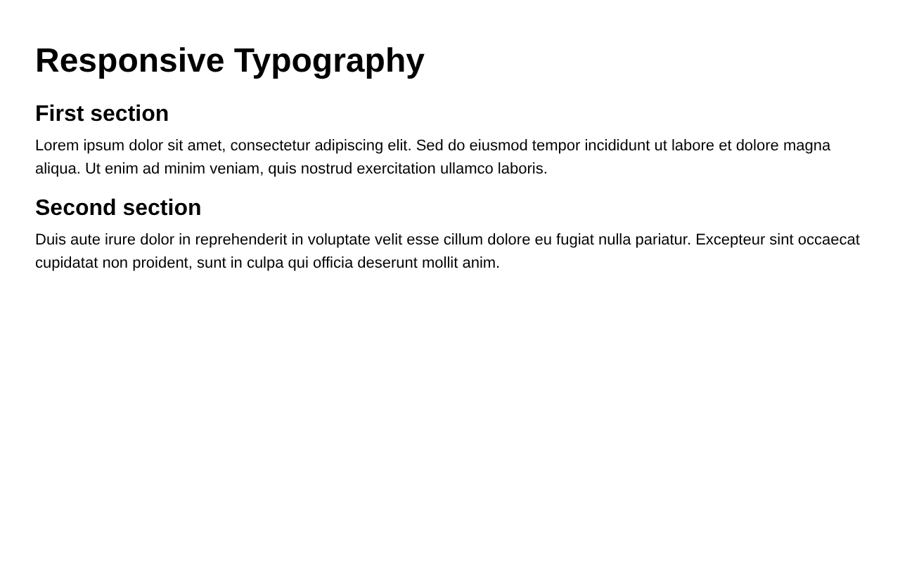

Tablet:
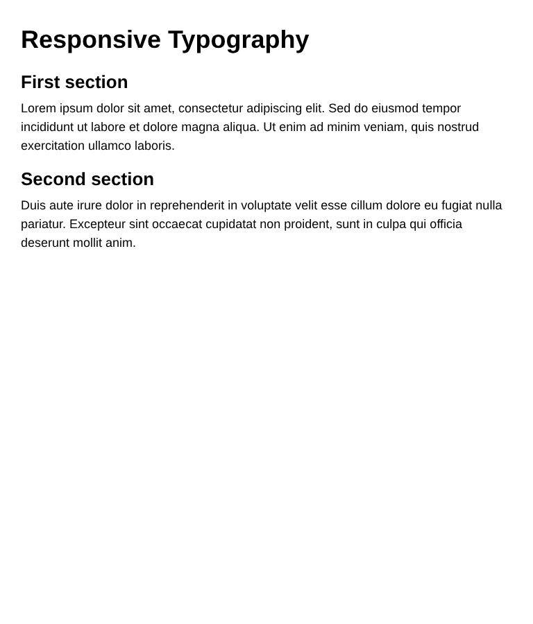

Mobile:
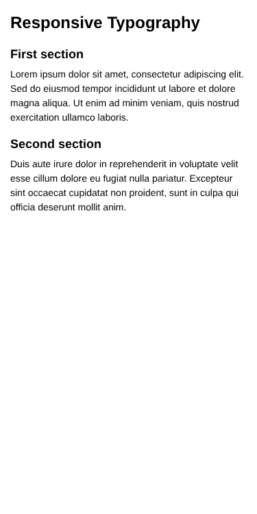

### Task 1. Responsive Layout with Media Queries
Create a webpage with three boxes in a row. Desktop: three side by side. Tablet: two in a row. Mobile: stacked vertically. Use only CSS media queries (no Bootstrap).

Implementation: the boxes are in a flex container with `flex-wrap: wrap`. Width is 100% on mobile, `calc(50% - 7.5px)` from 600px and `calc(33.333% - 10px)` from 992px.

Desktop:
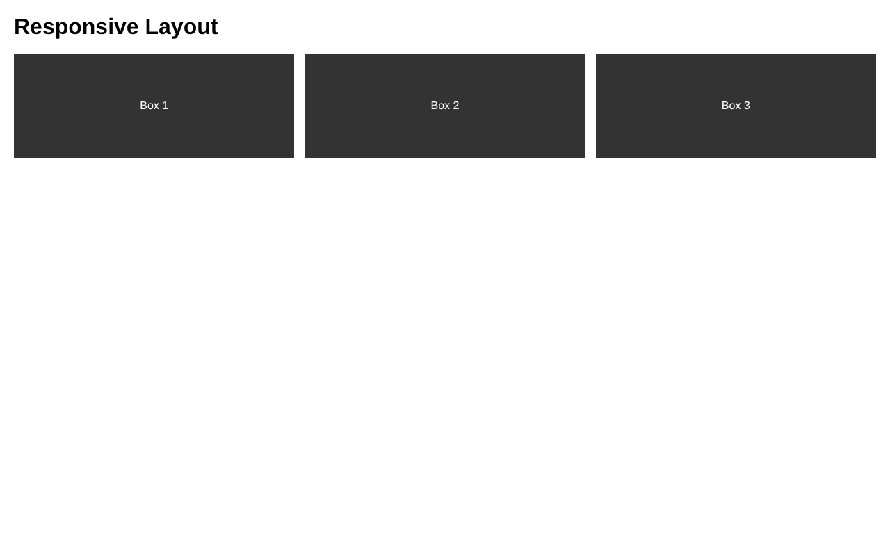

Tablet:
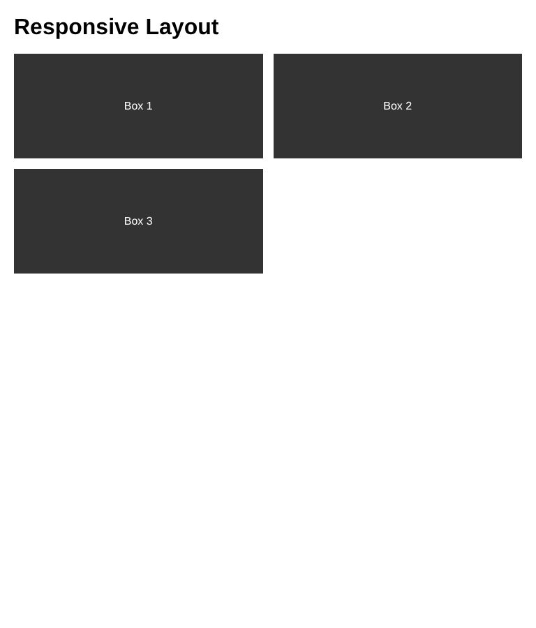

Mobile:
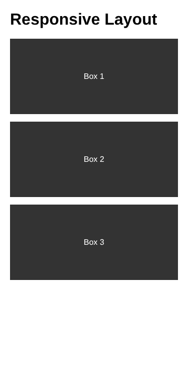

## Part 2. Bootstrap Grid System

### Task 2. Bootstrap Responsive Columns
Build a responsive layout using Bootstrap's 12-column grid with three columns: desktop - each column takes 4 of 12; tablet - two columns in the first row and one in the second; mobile - all columns stacked.

Implementation: every column has the classes `col-12 col-md-6 col-lg-4`.

Desktop:
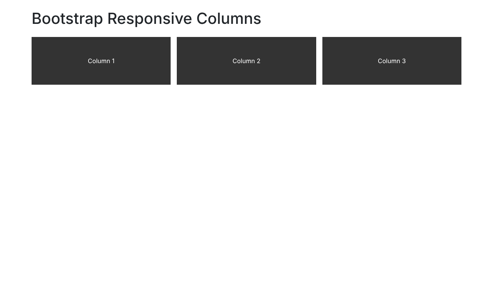

Tablet:
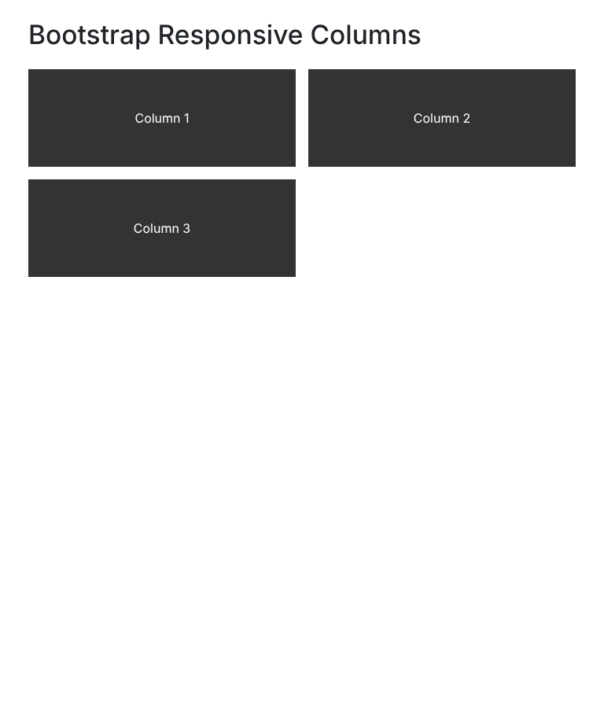

Mobile:
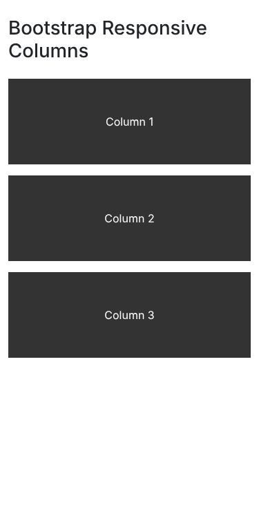

### Task 3. Bootstrap Navigation Bar
Create a responsive navigation bar using Bootstrap components: logo on the left, links on the right, collapse into a hamburger menu on smaller screens.

Implementation: `navbar navbar-expand-md` with `navbar-brand`, `navbar-toggler`, and a `collapse navbar-collapse` block with `ms-auto` on the list of links.

Desktop:
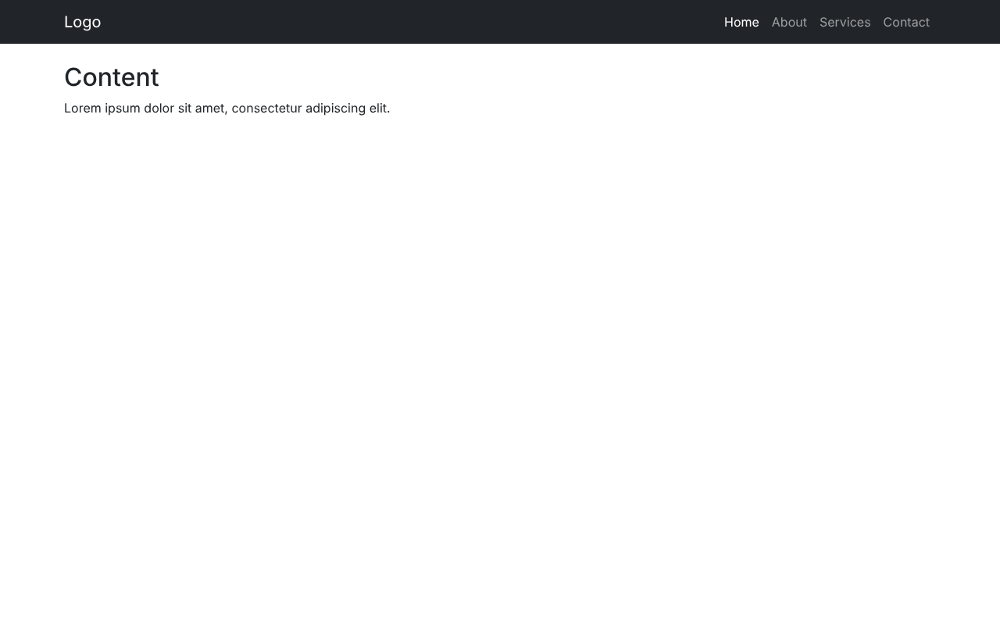

Mobile (menu closed):
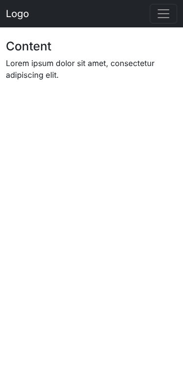

Mobile (menu opened):
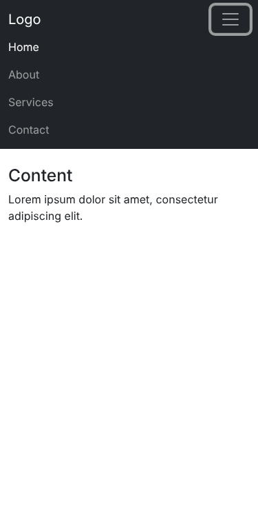

## Part 3. Combined Project

### Task 4. Responsive Portfolio Page
Create a portfolio page using both Media Queries and Bootstrap Grid: header with a Bootstrap navbar, main section divided into two parts (left - portfolio projects as cards in the Bootstrap grid, right - sidebar with personal info and contact details), and a footer. Custom media queries adjust font sizes, spacing and element visibility for mobile, tablet and desktop.

Implementation:
- Header: Bootstrap navbar (`navbar-expand-md`).
- Main: `col-12 col-lg-8` for projects and `col-12 col-lg-4` for the sidebar. Project cards are in a nested row with `col-12 col-sm-6 col-xl-4`.
- Footer: full width at the bottom.
- Media queries (576px and 992px) change font sizes, padding, and hide some sidebar lines (`.hide-mobile`) on mobile.

Desktop:
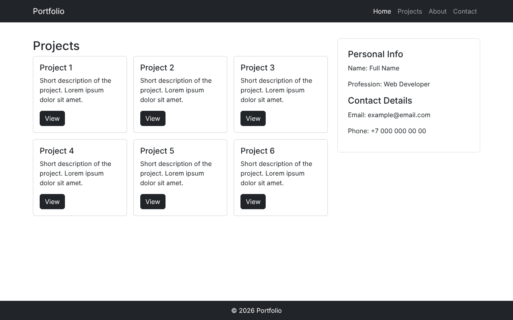

Tablet:
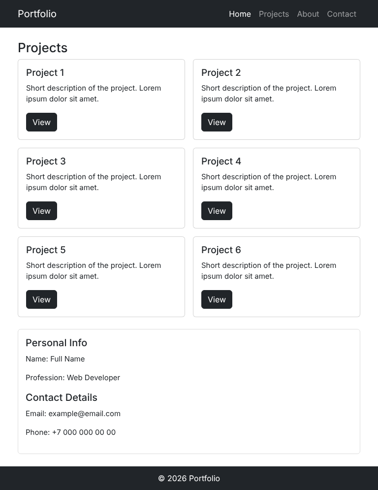

Mobile:
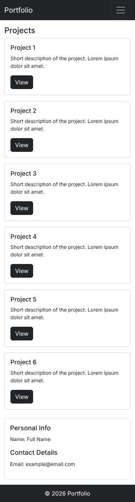

Mobile (menu opened):
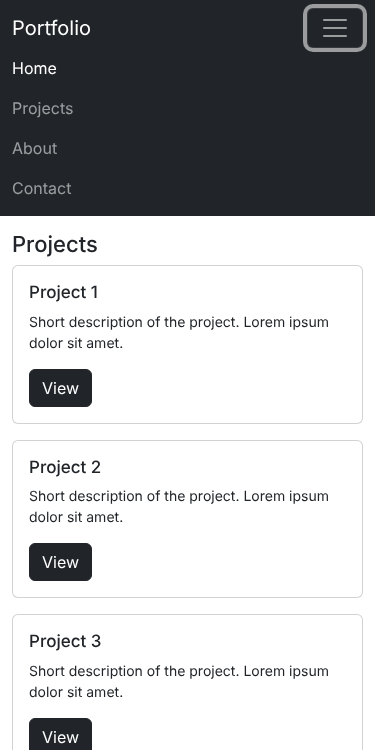

## Summary
I did the first two tasks with plain CSS media queries using a mobile-first approach: default styles are for mobile and `min-width` queries change them for tablet and desktop. Then I used the Bootstrap 12-column grid with responsive classes (`col-12`, `col-md-6`, `col-lg-4`) to get the same behavior with less code, and built a responsive navbar with the collapse component. In the last task I combined both: Bootstrap grid and navbar for the structure, and custom media queries for font sizes, spacing and hiding elements on small screens.
